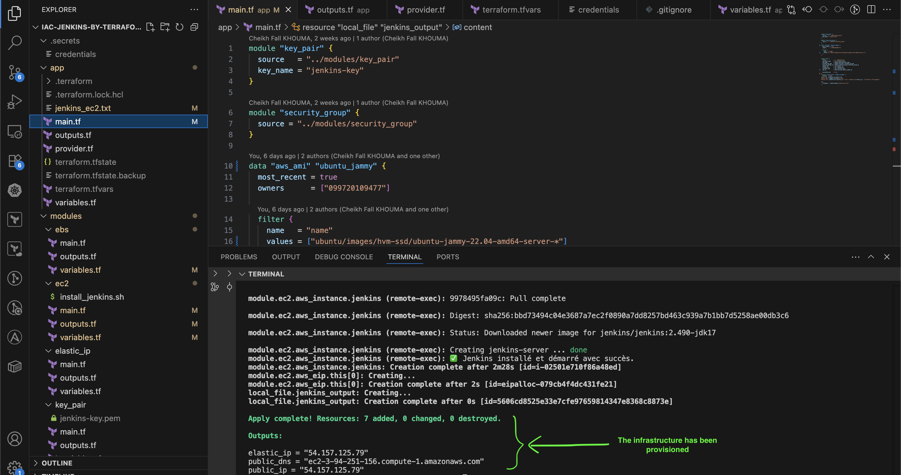
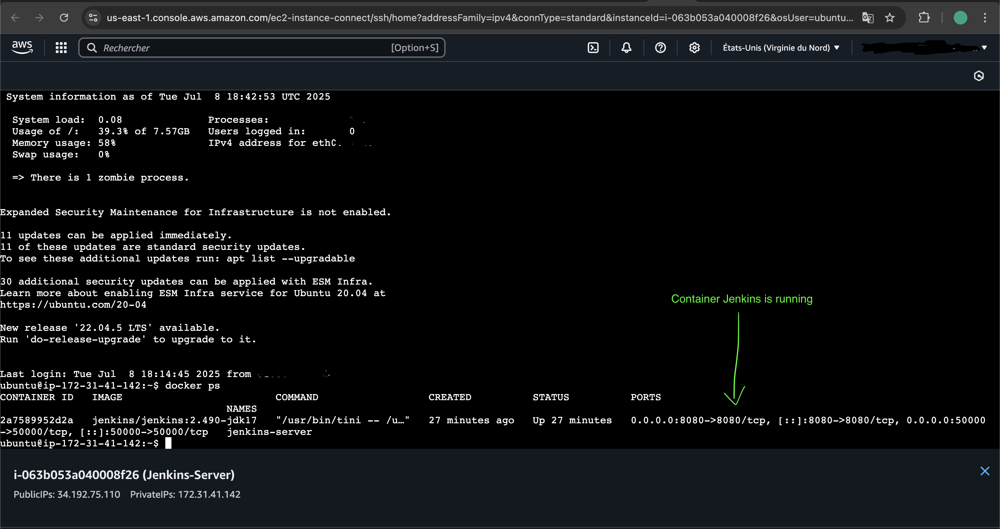
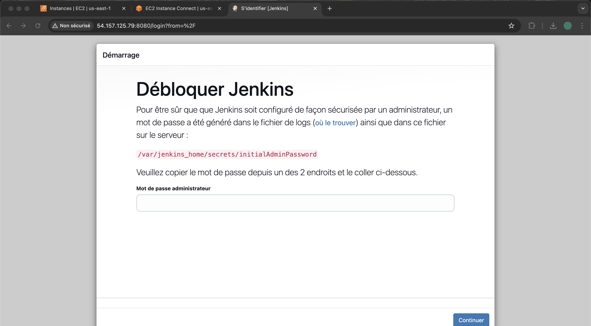

# Terraform-IaC-Jenkins

🛠️ Mini-Projet : Déploiement Automatisé d’un Serveur Jenkins sur AWS
🎯 Objectif
Créer une infrastructure modulaire avec Terraform permettant le déploiement automatisé d’un serveur Jenkins conteneurisé sur une instance EC2 Ubuntu (Jammy) dans AWS.

📌 Tâches Principales

🔹 1. Créer un module EC2
  Utiliser l’image Ubuntu Jammy.

L’instance devra :

  Être attachée à un volume EBS.

  Être associée à une IP publique.

  Variables à rendre dynamiques :

  Taille de l’instance.

  Tags de l’instance.

🔹 2. Créer un module EBS
Créer un volume EBS.

  Variable à rendre dynamique :

  Taille du volume.

🔹 3. Créer un module pour l’IP publique
  Allouer une adresse Elastic IP.

  Attacher cette IP à l’instance EC2.

  Lier la sécurité réseau via le Security Group.

🔹 4. Créer un module de Security Group
  Ouvrir les ports suivants :

  80 (HTTP)

  443 (HTTPS)
  
  8080 (Jenkins)

🔹 5. Créer un module pour la paire de clés
  Générer dynamiquement une paire de clés (SSH).

  Permettre la connexion SSH à l’instance EC2.

🔹 6. Créer un dossier app/
  Ce dossier sera le point central pour :

  Appeler et intégrer les 5 modules précédents.

  Surcharger les variables pour rendre le tout paramétrable.

  Déployer l’architecture complète de façon modulaire et dynamique.

🔹 7. Installation de Jenkins avec Docker Compose
  Après le déploiement :

  Installer Docker et Docker Compose.

  Lancer Jenkins en mode conteneurisé.

  Laisser Jenkins accessible via l’IP publique sur le port 8080.

🔹 8. Exporter les métadonnées
  En fin de déploiement :

  Écrire dans un fichier nommé jenkins_ec2.txt :

  L’adresse IP publique de l’instance Jenkins.

  Le nom de domaine s’il existe (ou vide sinon).

✅ Résultat attendu
  Déploiement répétable et modulaire.

  Jenkins opérationnel via navigateur (port 8080).

  Fichier jenkins_ec2.txt contenant les informations essentielles d’accès.

